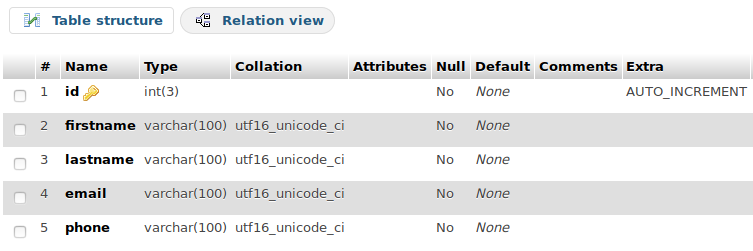

# Entry-Management-System
An entry management system 

Backend Designed in **PHP** and **MySQL** database is integrated using **phpmyadmin**.

Make sure to configure phpmyadmin and MySQL server in the local machine with same username and password to integrate the Data Base

Here PHP smtp mail() is used to send mail to the host and the visitor. [PHPMailer](https://github.com/PHPMailer/PHPMailer) can also be used and configured.

SMS API is not enabled for now, as the WebApp is hosted locally. But can easily be integrated using MSG91 API.

## Files Conserned in the Management System:
1. **host.php** : Make Registration for the HOST (Multiple host can be enabled at a time)
2. **visitor.php** : Make checkin for visitors
3. **visitor1.php** : Make Checkout for visitors

## Making Connection With the Data Base 

This is a sample connection setup for a database named **'entry-management-system'** running on the **localhost** server and let the username and password of phpmyadmin is **'root'** and **'password'** respectively.

```php
$servername = "localhost";
$username = "root";
$password = "password";
$dbname = "entry-management-system";

// Create connection
$conn = new mysqli($servername, $username, $password, $dbname);

// Check connection
if ($conn->connect_error) {
    die("Connection failed: " . $conn->connect_error);
}else{
    echo "Connected successfully";
}
 ```

### Table in the Data Base:

#### Setup the following table in the phpmyadmin to integrate with the backend codes 

1. visitor Table: Stores the visitor's information 


2. host table: Stores the host information



